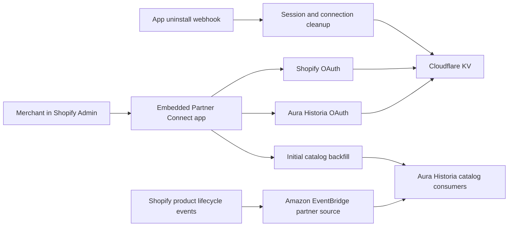

<h1 align="center">Aura Historia Partner Connect</h1>

<p align="center">
  A quiet, reliable bridge between Shopify product catalogs and the Aura Historia sales channel.
</p>

<p align="center">
  <a href="https://github.com/aura-historia/shopify-app/actions/workflows/ci.yml"></a>
  <a href="./LICENSE"></a>
  <a href="./package.json"></a>
  <a href="https://shopify.dev/docs/api/usage/versioning"></a>
</p>

<p align="center">
  <a href="#architecture">Architecture</a>&nbsp;&nbsp;·&nbsp;&nbsp;
  <a href="#local-development">Local development</a>&nbsp;&nbsp;·&nbsp;&nbsp;
  <a href="#quality-checks">Quality checks</a>&nbsp;&nbsp;·&nbsp;&nbsp;
  <a href="#deployment">Deployment</a>
</p>

---

## In brief

**Aura Historia Partner Connect** is a public, embedded Shopify sales-channel app. It lets approved merchants connect their shops to Aura Historia, makes product discovery possible on Aura Historia, and returns shoppers to the merchant’s Shopify store for checkout.

The app intentionally owns only the integration edge: authentication, merchant connection, initial catalog backfill, session storage, and uninstall cleanup. Amazon EventBridge routing and downstream catalog consumers are maintained separately.

| Shopify | Aura Historia |
| --- | --- |
| Merchant installs from Shopify App Store or Admin | Merchant authorizes Aura Historia from the embedded app |
| Shopify supplies trusted shop context and OAuth approval | Connection metadata is stored in Cloudflare KV |
| Product events are delivered to the configured EventBridge partner source | Catalog records are published for discovery |
| Shopper continues to the merchant’s Shopify storefront | No checkout or merchant-of-record responsibility moves to Aura Historia |

## Architecture



### What lives here

- React Router application and embedded Shopify app shell
- Shopify authentication, Aura Historia OAuth, and connection state
- Cloudflare Worker deployment and Cloudflare KV session storage
- Initial product backfill orchestration
- Shopify sales-channel configuration in `extensions/channel-config`
- Uninstall cleanup at `app/routes/webhooks.app.uninstalled.tsx`

### What does not

- EventBridge infrastructure, rules, or consumers
- A checkout experience or storefront
- Demo pages, sample mutations, or placeholder app logic

## Event delivery

| Topic | Destination | Purpose |
| --- | --- | --- |
| `products/create`, `products/update`, `products/delete` | Aura Historia Amazon EventBridge partner source | Keep merchant product discovery records current |
| `customers/data_request`, `customers/redact`, `shop/redact` | Aura Historia Amazon EventBridge partner source | Required public-app privacy and compliance handling |
| `app/uninstalled` | This app’s deployed HTTPS endpoint | Remove Shopify session and Aura Historia connection data |
| `bulk_operations/finish` | This app’s deployed HTTPS endpoint | Complete the initial catalog backfill workflow |

The required public-app compliance subscriptions and product subscriptions are declared in `shopify.app.toml` and `shopify.app.prod.toml`.

## Local development

### Requirements

- [Node.js](https://nodejs.org/) **22.18 or later**
- A Shopify Partner account and app credentials
- A Cloudflare KV namespace for session storage
- Aura Historia OAuth client credentials

### Start the app

```bash
npm ci
npm run dev
```

The default command runs `shopify app dev --use-localhost`.

Create local runtime configuration for the Aura Historia OAuth client. The app requires:

```bash
AURA_HISTORIA_OAUTH_CLIENT_ID=
AURA_HISTORIA_OAUTH_CLIENT_SECRET=
AURA_HISTORIA_OAUTH_ENV=dev
```

These optional variables override the built-in environment defaults when needed:

```bash
AURA_HISTORIA_API_BASE_URL=
AURA_HISTORIA_OAUTH_AUTHORIZE_URL=
AURA_HISTORIA_OAUTH_TOKEN_URL=
AURA_HISTORIA_OAUTH_REDIRECT_URI=
AURA_HISTORIA_OAUTH_SCOPE=
```

> **Webhook testing:** Shopify localhost mode cannot call your machine directly. Product and compliance events continue to use EventBridge, while `app/uninstalled` remains pinned to the deployed HTTPS app URL. For direct local testing of the backfill completion webhook, use tunnel mode:
>
> ```bash
> npm run dev:tunnel
> ```

## Shopify configuration

The repository uses separate Shopify configuration files to keep stage-specific EventBridge destinations explicit:

| File | Use |
| --- | --- |
| `shopify.app.toml` | Default local/stage configuration using the development EventBridge partner source |
| `shopify.app.prod.toml` | Production configuration using the production EventBridge partner source |
| `shopify.app.tunnel.toml` | Development tunnel mode; exposes the backfill completion endpoint through the active tunnel |

The app requests only `read_products` and `read_locales`. Installation starts from Shopify-owned surfaces, which supply the trusted `shop` and `host` context—merchants are not asked to manually enter a shop domain.

## Quality checks

Run the full suite before opening a pull request:

```bash
npm run lint
npm run typecheck
npm run test
npm run build
```

| Command | Responsibility |
| --- | --- |
| `npm run lint` | Biome formatting and lint checks |
| `npm run typecheck` | React Router type generation and TypeScript validation |
| `npm run test` | Focused Node test suite |
| `npm run build` | Production React Router build |

GitHub Actions runs these checks across Node.js 22.18, 24.15, and 26.1 on pushes and pull requests. See [`.github/workflows/ci.yml`](./.github/workflows/ci.yml).

## Deployment

- `npm run lint`
- `npm run typecheck`
- `npm run test`
- `npm run build`

```bash
npm run cf-deploy       # Build and deploy the Cloudflare Worker
npm run config:use:prod # Select Shopify production configuration locally
npm run deploy:prod     # Deploy Shopify app configuration to production
```

The GitHub Actions workflow requires these repository secrets:

- `CLOUDFLARE_API_TOKEN`
- `CLOUDFLARE_ACCOUNT_ID`
- `SHOPIFY_APP_AUTOMATION_TOKEN`

See [`.github/workflows/deploy.yml`](./.github/workflows/deploy.yml) for the release definition.

## Public app information

- Website: [aura-historia.com](https://aura-historia.com)
- Privacy: [aura-historia.com/privacy](https://aura-historia.com/privacy)
- Terms: [aura-historia.com/terms-and-conditions](https://aura-historia.com/terms-and-conditions)
- Imprint: [aura-historia.com/imprint](https://aura-historia.com/imprint)
- Support: [contact@aura-historia.com](mailto:contact@aura-historia.com)

## License

Distributed under the [MIT License](./LICENSE). Copyright © 2026 Aura Historia.

---

<p align="center">
  
</p>
